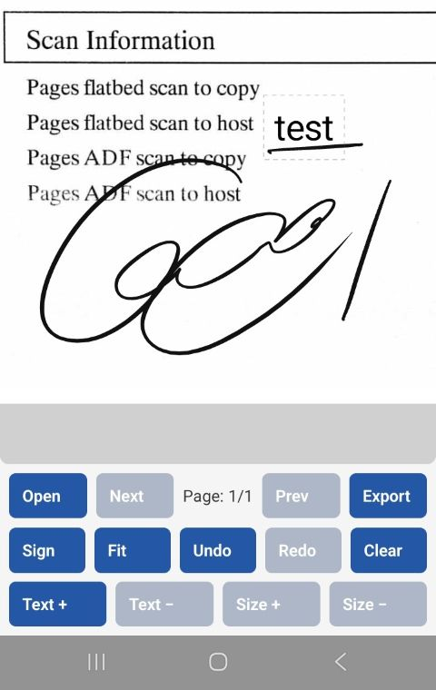

# @grego5/react-native-inksign-pdf

- PDF documents singing with ink signature module for React Native.
- Displays loaded PDF as background. Including swipe/method pagination.
- Renders document with PDFium binaries, mainly to support option to provide fallback font, since this option unavailable in platform native pdf libraries. For example Acrobat Reader can handle missing fonts, many other pdf viewers just render blank space instead.
- Supports velocity-driven ink, text annotations, and histroy.
- Android using custom c++ InkEngine, integrating Google Ink line modeling algorithms, and low-latency front buffer api for zero lag drawing before committing to standard render node. For some reason uncommon technique in most apps.
- iOS basic compatibility using PencilKit, because I can't test similar low level implementation without mac. No web support.
- Export changes to new PDF as vector path, preserving minimal size and high quality on Android, rasterized overlay as iOS fallback.

Intended workflow: open pdf, double click an area or dedicated button to enter edit mode, zoom into tapped area or prefined coordinates,
draw a signature, save to new file. The brush doesn't scale with zoom level, but the drawn shape does.



## Requirements

- Node.js 20
- Android 12/API 31 with Android S extension 18
- iOS 15.1
- A native iOS or Android project

## Installation

```sh
npm install git+https://github.com/grego5/react-native-inksign-pdf.git
```

For iOS:

```sh
npx pod-install
```

The module requires a native React Native build; it is not supported in Expo
Go.

### Android native artifacts

Android builds use the pinned release record in
`android/ink-engine-release.json`. Gradle downloads and verifies the single
InkEngine archive during the native build, then caches its ABI libraries under
the Gradle `build` directory. The npm package does not contain InkEngine
static libraries or the Google Ink/Abseil source trees. A previously verified
cache can be reused offline; a missing or invalid cache requires access to the
pinned GitHub Release.

Repository developers can deliberately compile the checked-out sources with
`-PReactNativeInkSignPdf_useSourceInkEngine=true`. Normal consumer builds do
not select source mode automatically.

## Quick start

```tsx
import { useRef, useState } from 'react';
import { Button, StyleSheet, Text, View } from 'react-native';
import {
  InkSignView,
  type PageInfo,
  type InkSignViewHandle,
  type StateChangeEvent,
} from '@grego5/react-native-inksign-pdf';

export function SigningView({ pdfPath }: { pdfPath: string }) {
  const pdf = useRef<InkSignViewHandle>(null);
  const [page, setPage] = useState<PageInfo | null>(null);
  const [state, setState] = useState<StateChangeEvent>({
    canUndo: false,
    canRedo: false,
    isDirty: false,
    mode: 'view',
  });
  const [status, setStatus] = useState('Choose a PDF to begin');

  async function openPdf() {
    try {
      const info = await pdf.current!.open(pdfPath);
      setPage(info);
      setStatus('Ready to sign');
    } catch {
      setStatus('Unable to open PDF');
    }
  }

  async function savePdf() {
    try {
      const outputPath = await pdf.current!.finalize();
      setStatus(`Signed PDF: ${outputPath}`);
    } catch {
      setStatus('Unable to export PDF');
    }
  }

  return (
    <View style={styles.screen}>
      <InkSignView
        ref={pdf}
        style={styles.pdf}
        strokeColor="#111111"
        strokeMinWidth={2}
        strokeMaxWidth={4}
        onStateChange={setState}
        onPageChange={setPage}
      />

      <Text style={styles.status}>
        {page ? `Page ${page.pageIndex + 1} of ${page.pageCount}` : status}
        {page ? ` · ${state.mode}${state.isDirty ? ' · unsaved' : ''}` : ''}
      </Text>

      <View style={styles.toolbar}>
        <Button title="Open PDF" onPress={() => void openPdf()} />
        <Button
          title="Previous"
          disabled={!page || page.pageIndex === 0}
          onPress={() => {
            try {
              pdf.current?.previousPage();
            } catch (error) {
              console.warn('Page change failed', error);
            }
          }}
        />
        <Button
          title="Next"
          disabled={!page || page.pageIndex === page.pageCount - 1}
          onPress={() => {
            try {
              pdf.current?.nextPage();
            } catch (error) {
              console.warn('Page change failed', error);
            }
          }}
        />
        <Button
          title="Draw"
          disabled={!page}
          onPress={() => {
            try {
              pdf.current?.enterEditMode();
            } catch (error) {
              console.warn('Mode change failed', error);
            }
          }}
        />
        <Button
          title="View"
          disabled={!page}
          onPress={() => {
            try {
              pdf.current?.enterViewMode();
            } catch (error) {
              console.warn('Mode change failed', error);
            }
          }}
        />
        <Button
          title="Place text"
          disabled={!page}
          onPress={() => {
            try {
              pdf.current?.insertAnnotationOn();
            } catch (error) {
              console.warn('Text placement failed', error);
            }
          }}
        />
        <Button title="Undo" disabled={!state.canUndo} onPress={() => pdf.current?.undo()} />
        <Button title="Redo" disabled={!state.canRedo} onPress={() => pdf.current?.redo()} />
        <Button title="Clear" disabled={!state.isDirty} onPress={() => pdf.current?.clear()} />
        <Button
          title="Save signed PDF"
          disabled={!page || !state.isDirty}
          onPress={() => void savePdf()}
        />
      </View>
    </View>
  );
}

const styles = StyleSheet.create({
  screen: { flex: 1 },
  pdf: { flex: 1 },
  status: { padding: 8, textAlign: 'center' },
  toolbar: {
    flexDirection: 'row',
    flexWrap: 'wrap',
    gap: 8,
    justifyContent: 'center',
    padding: 8,
  },
});
```

`open()` accepts a caller-owned local PDF path and starts in view mode. Keep the
source file readable while the view is mounted. The `fallbackFont` component prop can
provide one absolute local `.ttf`, `.otf`, or collection path for PDFium
substitution. The resource is captured when `open()` runs, so changing it
requires reopening the document. Invalid resources reject `open()`; a valid
font is used on a best-effort basis even if some glyphs are missing. iOS
support remains experimental until tested on macOS and a device. `finalize()`
returns the path to the signed PDF; copy that file to durable application
storage before unmounting the view. Native temporary artifacts are kept below
the app cache directory; iOS can override its leaf directory with the
`ReactNativeInkSignPdfCacheDirectoryName` Info.plist key, and Android with the
`com.margelo.nitro.inksignpdf.CACHE_DIRECTORY_NAME` application metadata key.

## Component API

### Props

- `fallbackFont` — one optional PDFium fallback font resource; changes take effect on the next `open()`.
- `strokeColor` — ink color as `#RRGGBB`.
- `strokeMinWidth`, `strokeMaxWidth` — ink width range.
- `strokeSmoothing` — Android input smoothing from `0` to `1`.
- `defaultTextFontSize` — font size for new text annotations.
- `defaultTextColor` — color saved with new text annotations.
- `outlineColor`, `selectedOutlineColor` — text outline colors.
- `editorBackgroundColor`, `selectedBackgroundColor` — text UI colors.
- `doubleTap` — `{ zoom, enterEditMode? }` double-tap behavior.
- `keyboardAvoidanceEnabled` — keep the text editor above the keyboard.
- `onStateChange` — coarse interaction and history state.
- `onPageChange` — notification after a real page switch.

Example color configuration:

```tsx
<InkSignView
  strokeColor="#111827"
  defaultTextColor="#0F172A"
  outlineColor="#64748B"
  selectedOutlineColor="#2563EB"
  editorBackgroundColor="#FFFFFF"
  selectedBackgroundColor="#DBEAFE"
/>
```

Colors use opaque `#RRGGBB` strings. `defaultTextColor` is saved with new
annotations; the other text colors control presentation.

### Ref methods

```ts
open(path, options?)
nextPage()
previousPage()
getViewport()
enterEditMode(viewport?)
enterViewMode(viewport?)
undo()
redo()
clear()
insertAnnotationOn()
insertAnnotationOff()
increaseTextSize()
decreaseTextSize()
removeTextAnnotation()
finalize()
```

`open()` returns page metadata. Page navigation is synchronous to initiate and
publishes the committed result through `onPageChange`:

```ts
{
  (pageIndex, pageCount, width, height);
}
```

`getViewport()` returns a viewport snapshot synchronously and throws when the
view is not ready. Synchronous commands throw validation errors directly.

Page indexes are zero-based. Viewport values use canonical PDF page
coordinates:

```ts
{
  (x, y, zoom);
}
```

Pass paired `x` and `y` to focus a page point. Pass `zoom` for an absolute
zoom level. An empty viewport object fits and centers the page; omitting the
argument preserves the current viewport where applicable.

## Interaction model

- View mode provides pan, pinch zoom, and page navigation.
- Edit mode accepts finger or stylus input for velocity-driven ink and keeps the
  viewport fixed.
- `insertAnnotationOn()` arms one text placement; the next page tap opens the
  native text editor.
- Text, ink, undo, redo, and clear are managed by the native view.
- `onStateChange` reports `canUndo`, `canRedo`, `isDirty`, and one of
  `view`, `draw`, `textPlacement`, `textSelected`, or `textEditing`.
- The application owns its toolbar and any saved viewport bookmarks.

## Export

```tsx
const signedPath = await pdf.current?.finalize();
```

The source PDF is preserved. The returned file contains the committed ink and
text annotations and is written to native temporary storage. Copy it to the
application's durable destination when it must outlive the signing view.

## Further documentation

- [Public API spec](./src/InkSignView.nitro.ts)
- [Architecture and invariants](./.agents/skills/inksign-pdf-docs/references/architecture.md)
- [Android input and viewport behavior](./.agents/skills/inksign-pdf-docs/references/android/viewport-input.md)
- [iOS input and viewport behavior](./.agents/skills/inksign-pdf-docs/references/swift-ios/viewport-input.md)

