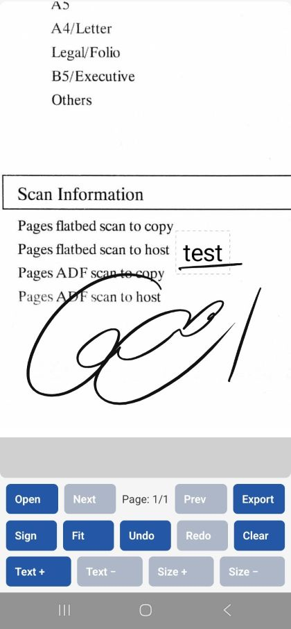

# @grego5/react-native-inksign-pdf

- Sign PDF documents with ink and text annotations.
- Open PDFs or images from a file path or the native file picker.
- Add, remove, and reorder pages.
- Navigate pages, zoom, and undo or redo edits.
- Export the signed document as a new PDF.

Use the editor to add a signature or text, then export the document.



## Requirements

- Node.js 20
- Android 7.0/API 24 or newer
- iOS 16.0
- A native iOS or Android project

## Installation

```sh
npm install git+https://github.com/grego5/react-native-inksign-pdf.git
```

For iOS:

```sh
npx pod-install
```

The module requires a native React Native build; it is not supported in Expo
Go.

## Quick start

Open a PDF, draw a signature, place text, and save the result:

```tsx
import { useRef, useState } from 'react';
import { Button, Text, View } from 'react-native';
import {
  InkSignView,
  type InkSignViewHandle,
  type PageInfo,
} from '@grego5/react-native-inksign-pdf';

export function SigningView({ pdfPath }: { pdfPath: string }) {
  const pdf = useRef<InkSignViewHandle>(null);
  const [page, setPage] = useState<PageInfo | null>(null);
  const [savedPath, setSavedPath] = useState('');

  async function openPdf() {
    const info = await pdf.current?.open(pdfPath);
    if (info) setPage(info);
  }

  async function savePdf() {
    const path = await pdf.current?.finalize();
    if (path) setSavedPath(path);
  }

  return (
    <View style={{ flex: 1 }}>
      <InkSignView ref={pdf} style={{ flex: 1 }} strokeColor="#111827" onPageChange={setPage} />
      {page && (
        <Text>
          Page {page.pageIndex + 1} of {page.pageCount}
        </Text>
      )}
      <Button title="Open PDF" onPress={() => void openPdf()} />
      <Button title="Draw" onPress={() => pdf.current?.enterEditMode()} />
      <Button title="Place text" onPress={() => pdf.current?.insertAnnotationOn()} />
      <Button title="Undo" onPress={() => pdf.current?.undo()} />
      <Button title="Save PDF" onPress={() => void savePdf()} />
      {savedPath !== '' && <Text>Saved to {savedPath}</Text>}
    </View>
  );
}
```

Tap the page after choosing **Draw** or **Place text**. `finalize()` returns a
temporary PDF path; copy the file if it needs to remain available after the
signing view closes.

On Android, an optional fallback font can use one shared local cache file. Set
`uri` to the app's writable font file and `url` to its download source; a valid
file already at `uri` is reused:

```tsx
<InkSignView androidFallbackFont={{ url: fontDownloadUrl, uri: fontCacheFileUri }} />
```

## Common actions

Add local PDF or image pages:

```ts
await pdf.current?.addPages({
  sources: [imagePath],
  imagePageSize: { width: 420, height: 594 },
  activePage: 'lastAdded',
});
```

Add text directly to a page. Bounds are in PDF points from the page's top-left:

```ts
pdf.current?.addTextAnnotation('Approved', { x: 48, y: 72, width: 172, height: 68 });
```

Fill a field beside a printed label:

```ts
await pdf.current?.insertTextByFieldName('Ada Lovelace', 'Signature', { occurrence: 'first' });
```

It skips labels without an adjacent writing line. Both field methods match
multiword names as adjacent complete words on one visual row, regardless of
the PDF's extracted word order.

Zoom to a signing line without adding text:

```ts
await pdf.current?.focusPageByFieldName('Signature', { zoom: 3, enterEditMode: true });
```

Both methods use the first eligible label by default; set `occurrence: 'last'`
to use the last. Zoom defaults to 2. Set `enterEditMode: true` to enable
freehand drawing after focusing. Both methods select the line on the resolved
direction's side: right for LTR, left for RTL. Use `direction: 'auto'` for app
direction, or explicitly set `'ltr'` or `'rtl'`; omission follows text-placement policy.

Use `nextPage()`, `previousPage()`, `undo()`, `redo()`, and `clear()` for
navigation and editing.
`hasInk()` reports whether the active page has committed ink.
See the [public API](./src/InkSignView.nitro.ts) for all props,
options, and methods.
